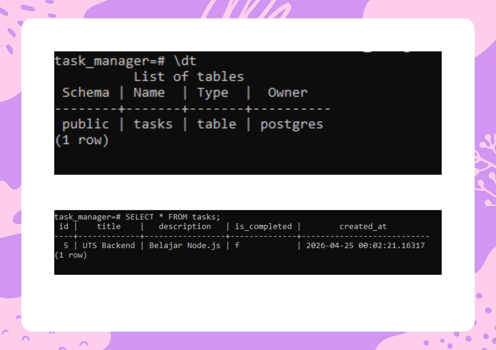
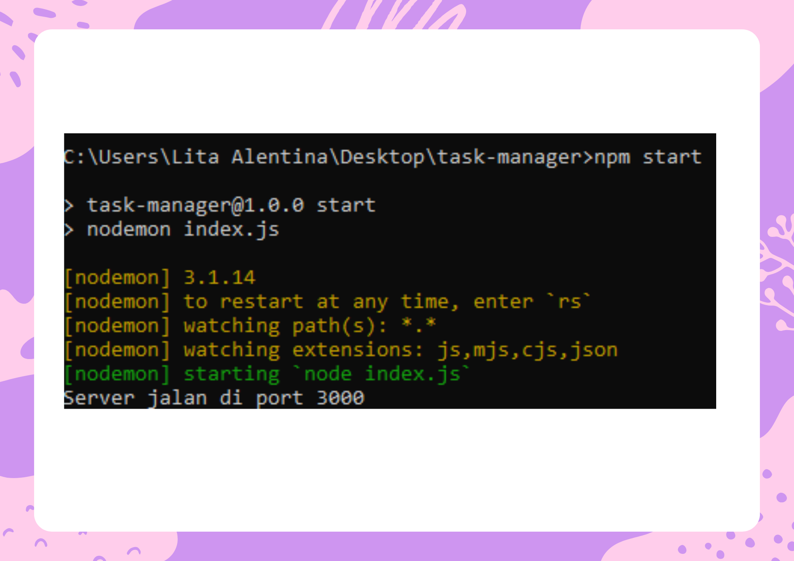
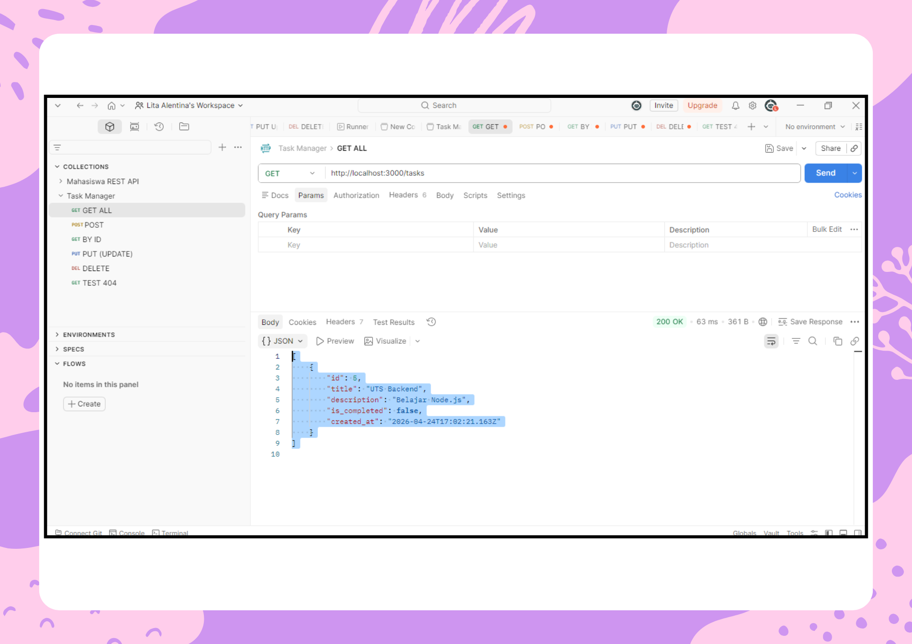
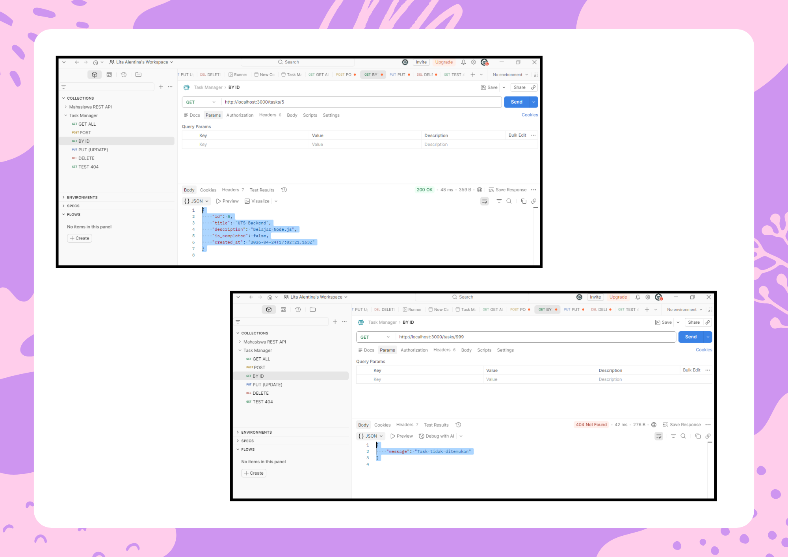
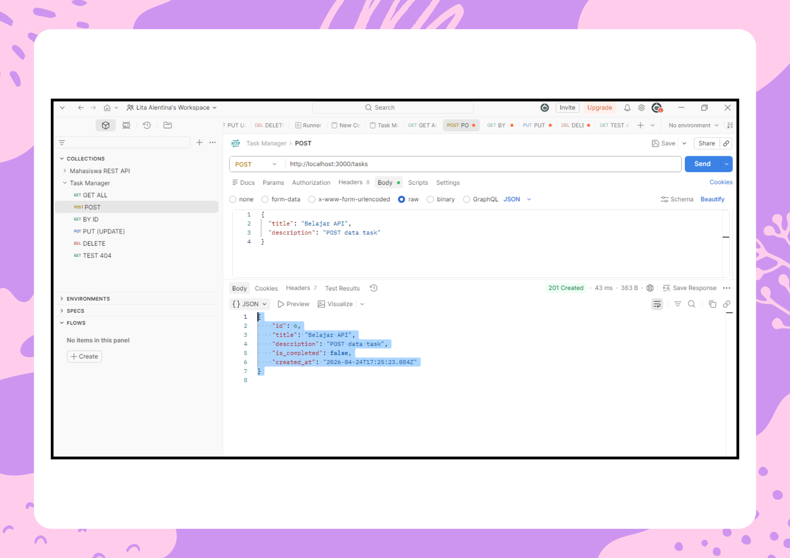
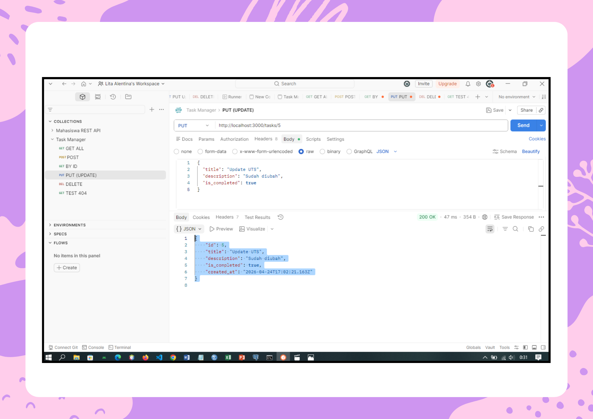
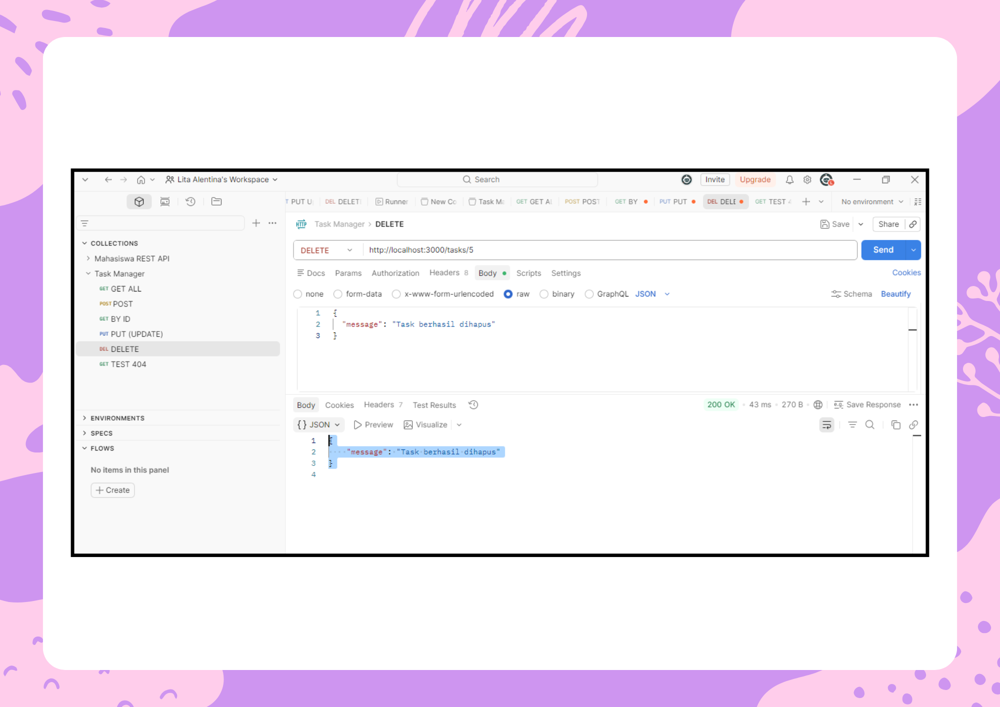
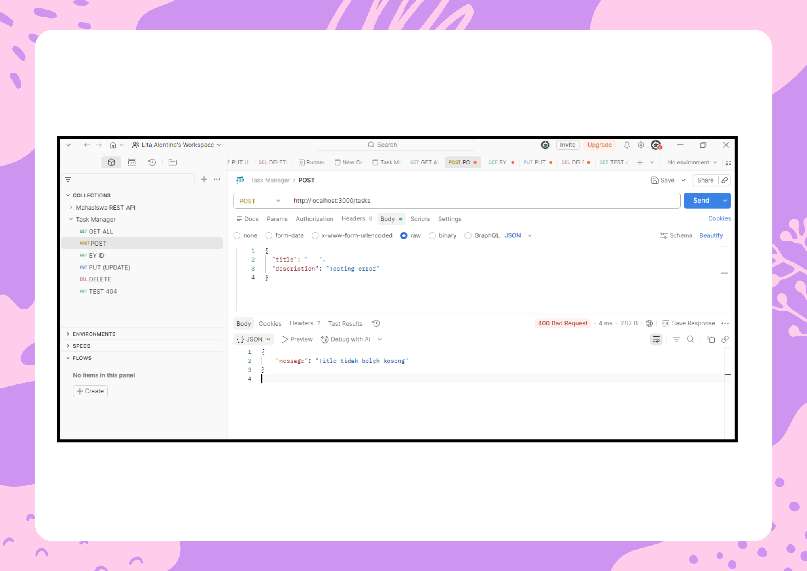
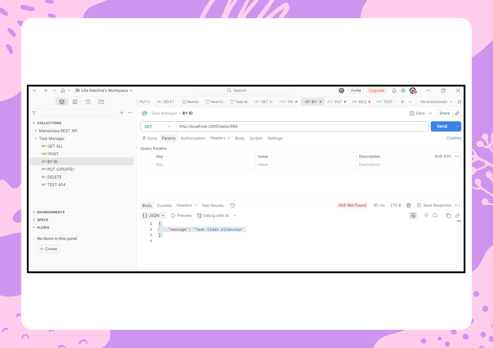
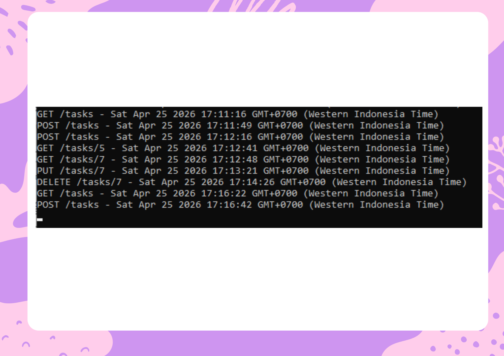

# Task Manager Backend

## 📌 Deskripsi Project

Proyek ini merupakan implementasi sistem backend untuk aplikasi **Task Manager**. Sistem ini dirancang untuk mengelola data tugas secara terstruktur dengan kemampuan menyimpan data secara permanen menggunakan database PostgreSQL.

Selain itu, sistem ini dilengkapi dengan fitur keamanan berupa validasi input serta pencatatan aktivitas (logging) untuk setiap request yang masuk ke server.

---

## 🗄️ Persiapan Database (PostgreSQL)

Database yang digunakan adalah PostgreSQL dengan tabel bernama **`tasks`**.

Struktur tabel:

| Field        | Tipe Data    | Keterangan                 |
| ------------ | ------------ | -------------------------- |
| id           | SERIAL       | Primary Key                |
| title        | VARCHAR(255) | Tidak boleh kosong         |
| description  | TEXT         | Deskripsi tugas            |
| is_completed | BOOLEAN      | Default: false             |
| created_at   | TIMESTAMP    | Default: CURRENT_TIMESTAMP |

---

## 📸 Dokumentasi Screenshot

### 1. Struktur Tabel Database

📌 Screenshot:

* Tampilan tabel `tasks` di PostgreSQL

**Output yang diharapkan:**

* Tabel `tasks` berhasil dibuat
* Memiliki kolom: id, title, description, is_completed, created_at
* Struktur sesuai dengan yang ditentukan pada soal



---

### 2. Server Berjalan

📌 Screenshot:

* Terminal saat menjalankan `npm start`
* Menampilkan: **Server jalan di port 3000**

**Output yang diharapkan:**

* Server berhasil dijalankan tanpa error
* Menampilkan pesan bahwa server aktif di port 3000



---

### 3. GET /tasks

📌 Screenshot:

* Hasil request GET semua data di Postman

**Output yang diharapkan:**

* Menampilkan seluruh data tugas dalam bentuk array JSON
* Jika belum ada data, akan menampilkan array kosong `[]`



---

### 4. GET /tasks/:id

📌 Screenshot:

* Hasil mengambil 1 data berdasarkan ID

**Output yang diharapkan:**

* Menampilkan 1 data tugas sesuai ID
* Jika ID tidak ditemukan, akan menampilkan error 404



---

### 5. POST /tasks

📌 Screenshot:

* Input data di Postman (body)
* Hasil data berhasil ditambahkan

**Output yang diharapkan:**

* Data baru berhasil ditambahkan ke database
* Response menampilkan data yang baru dibuat
* Memiliki ID otomatis dari database



---

### 6. PUT /tasks/:id

📌 Screenshot:

* Update data tugas
* Hasil perubahan data

**Output yang diharapkan:**

* Data tugas berhasil diperbarui
* Perubahan terlihat pada field seperti title, description, atau is_completed



---

### 7. DELETE /tasks/:id

📌 Screenshot:

* Hasil penghapusan data

**Output yang diharapkan:**

* Data berhasil dihapus dari database
* Response menampilkan pesan konfirmasi penghapusan



---

### 8. Validasi Error 400

📌 Screenshot:

* POST dengan title kosong
* Muncul pesan: **Title tidak boleh kosong**

**Output yang diharapkan:**

* Sistem menolak input yang tidak valid
* Menampilkan status 400 dengan pesan error yang sesuai



---

### 9. Error Handling 404

📌 Screenshot:

* Akses ID yang tidak ada
* Muncul: **Task tidak ditemukan**

**Output yang diharapkan:**

* Sistem mendeteksi data tidak ditemukan
* Menampilkan status 404 dengan pesan error



---

### 10. Logging Middleware

📌 Screenshot:

* Tampilan terminal yang menunjukkan:

  * GET /tasks
  * POST /tasks
  * dan request lainnya

**Output yang diharapkan:**

* Setiap request tercatat di console
* Menampilkan method, URL, dan waktu akses
* Contoh: GET /tasks - Sat Apr 25 2026 17:24:16 GMT+0700 (Western Indonesia Time)



---

## ⚙️ Spesifikasi Fitur

### 🔹 Middleware Logging

Sistem mencatat method, URL, dan waktu request ke console.

### 🔹 Validasi Input (Status 400)

Field `title` tidak boleh kosong atau hanya berisi spasi.

### 🔹 Error Handling (Status 404)

Data yang tidak ditemukan akan menampilkan pesan error.

### 🔹 Koneksi Database

Menggunakan PostgreSQL dengan package `pg`.

### 🔹 Menjalankan Aplikasi

Menggunakan nodemon agar server otomatis restart saat terjadi perubahan kode.

---

## 🛠️ Tech Stack

- **Node.js** – Runtime JavaScript untuk backend
- **Express.js** – Framework backend REST API
- **PostgreSQL** – Database relasional
- **pg (node-postgres)** – Koneksi Node.js ke PostgreSQL
- **Nodemon** – Auto-restart server saat development

---

## 🔗 Daftar Endpoint API

- `GET /tasks` → Mengambil semua data task
- `GET /tasks/:id` → Mengambil 1 task berdasarkan ID
- `POST /tasks` → Menambah task baru
- `PUT /tasks/:id` → Mengupdate data task
- `DELETE /tasks/:id` → Menghapus task

---

## 🚀 Cara Menjalankan Aplikasi

1. Install dependencies:

```
npm install
```

2. Jalankan server:

```
npm start
```

3. Akses aplikasi:

```
http://localhost:3000
```

---

## 👩‍💻 Informasi

- Nama: Lita Alentina
- NIM: 23552011097
- Kelas: TIF K 23B
- Universitas: Universitas Teknologi Bandung
- Tahun: 2026

---

## 📌 Catatan

Project ini dibuat untuk memenuhi tugas **Ujian Tengah Semester (UTS)** mata kuliah Pemrograman Web 2.
